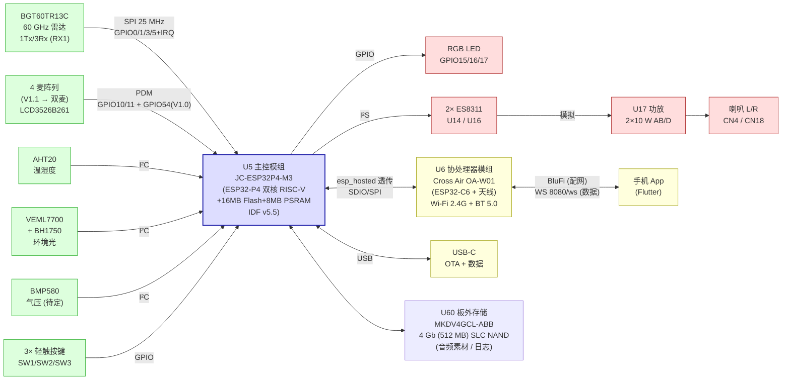
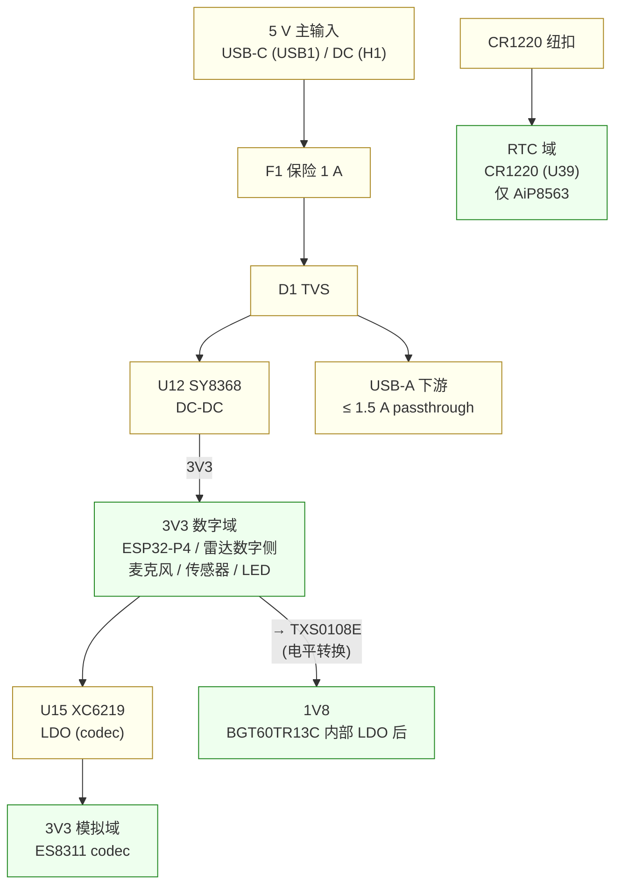
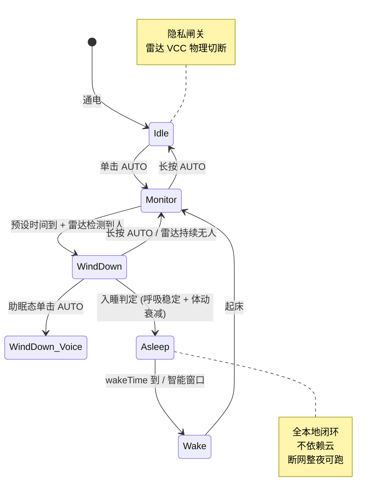
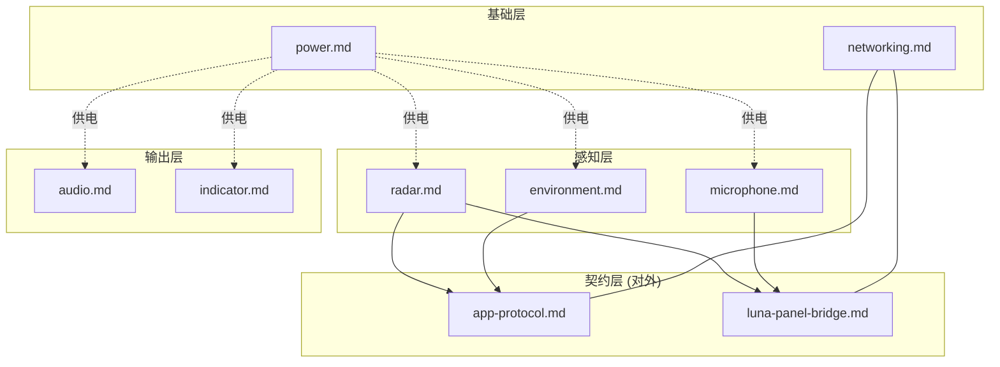

# System Block Diagram

> Status: 🟢 current · Last reviewed: 2026-05-18
>
> 整机数据流 + 电源域。GitHub 自动渲染 mermaid。给未来的自己 + 给 Luna 团队解释最快的一张图。

---

## 1. 数据流（信号链）

## 2. 电源域

## 3. 控制 / 状态机概览

详细状态机映射见 [luna-panel-bridge.md §8](luna-panel-bridge.md)。

## 4. 模块归属图

---

## 关键引脚速查

完整定义在 `components/my_lidar_inf/resource_map.h`（**权威**）。这里只列高频用到的。

| 信号 | GPIO | 模块 |
|---|---|---|
| Radar SPI SCLK | GPIO0 | radar |
| Radar SPI MOSI | GPIO1 | radar |
| Radar SPI MISO | GPIO3 | radar |
| Radar SPI CSN | GPIO5 | radar（软件控制） |
| Radar IRQ | GPIO2 | radar |
| Radar RSTN | GPIO13 | radar |
| RGB R / G / B | GPIO15 / 16 / 17 | indicator |
| PDM CLK | GPIO11 | microphone |
| PDM DATA0（MIC1+MIC4 立体声） | GPIO10 | microphone |
| PDM DATA1（MIC2+MIC3，V1.1 删） | GPIO54 | microphone |
| I²C SCL / SDA | （见 resource_map.h） | environment |
